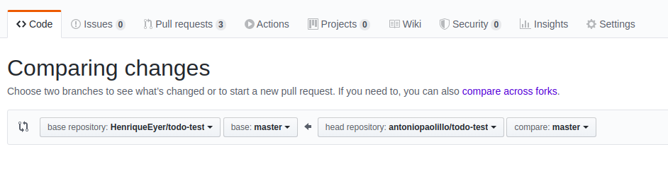

Esse é um projeto para o conteúdo sobre `Context API`.

### Antes de iniciar

Crie um fork desse projeto e para isso siga esse [tutorial de como realizar um fork](https://guides.github.com/activities/forking/).

Após feito o fork, clone o repositório criado para o seu computador.

Rode o `npm install`.

Vá para a branch master do seu projeto e execute o comando:
- `git branch`

Verifique se as seguintes branchs apareceram:

  `exercise-one`
  `exercise-two`
  `exercise-three`

- Cada branch dessas será um exercício.
- Mude para a branch `exercise-one` com o comando `git checkout exercise-one`. É nessa branch que você realizará a solução para o exercício 1, e assim por diante.

Observe o que deve ser feito nas instruções para cada exercício.

Após a solução dos exercícios, abra um PR no seu repositório forkado e, se quiser, mergeie para a master, sinta-se a vontade!

**Atenção!** Quando for criar o PR você irá se deparar com essa tela:

É necessário realizar uma mudança. Clique no *base repository* como na imagem abaixo:

Mude para o seu repositório. Seu nome estará na frente do nome dele, por exemplo: `antonio/TicTacToe`. Depois desse passo a página deve ficar assim:

Agora basta criar o PULL REQUEST clicando no botão `Create Pull Request`.

Para cada PR realize esse processo.

### COMEÇANDO OS EXERCÍCIOS

Nossa aplicação mostra os nomes de todos os professores e membros de escolas de magia até os eventos do quinto livro do universo de Harry Potter! Porem, não há nenhuma distinção entre aqueles atualmente em serviço, ou até mesmo os diretores, estão simplesmente todos juntos em uma lista.
Além disso, quando observamos o código, verficamos um clássico cenário de _prop drilling_, onde a informação passa por diversos componentes para só ao final ser utilizada.
Para corrigir essa situação, realize os exercicios e aplique seus conhecimentos em _Context API_!

#### Exercício 1

Aplique o _Context API_ para que a informação não precise passar por todos os componentes.

#### Exercício 2

Agora que você tem sua informação no estado global, faça um card distinto para diretores, onde cada um deverá ter o nome, imagem, e magia assinatura.

#### Exercício 3

Faça com que os professores tenham seu nome, imagem, e matéria ensinada em seus cards.

### Exercício 4

No componente Staff, separe os professores entre aqueles ativamente ensinando, e aqueles que não estão mais em hogwarts.